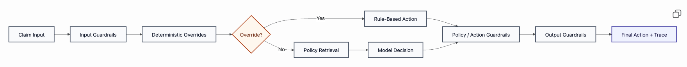
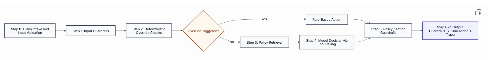
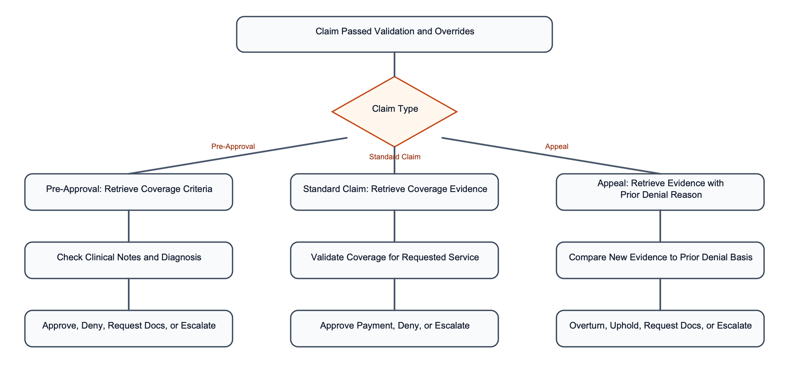

# Insurance Claims Review Agent System Design Report

## Executive Summary

This submission has two goals:

1. present a production-quality design for a claims-review agent that is policy-grounded, auditable, and safe under uncertainty
2. show a prototype that demonstrates the most important architectural choices in a working system

The core design choice is a **hybrid workflow** rather than an LLM-only agent. Deterministic rules own the hard override conditions from the spec. Retrieval owns policy grounding. The model is responsible only for the part that actually benefits from natural-language reasoning: mapping claim context and retrieved policy language to one structured next action.

That separation is the main idea behind the system. It is what keeps the workflow controllable enough for a claims setting while still allowing the system to reason over unstructured policy text.

The rest of the report is organized in four parts:

- **Part 1** describes the production design
- **Part 2** describes how I would evaluate it
- **Part 3** answers the open-ended safety and escalation questions directly
- **Part 4** explains what the prototype demonstrates and how to interpret it

## Part 1: Agent Design

### 1.1 System Overview

The system takes two inputs:

- structured claim data
- the correct insurer policy documents

It returns:

- one action from a fixed action set
- a short plain-English reason
- supporting policy citations
- a trace of how the decision was made

The high-level pipeline is:

`claim input → input guardrails → deterministic override checks → policy retrieval → model decision → policy / action guardrails → output guardrails → final action + trace`

This shape is intentional. A simpler design would send the entire problem to one model. I would not do that here. Claims review is not only a language task. It also contains hard workflow rules, safety boundaries, and audit requirements that are better enforced structurally than through prompting alone.

I split the workflow into four responsibilities:

- **input control**: validate schema, supported plans, and malformed or unsafe inputs
- **hard workflow rules**: implement the spec’s override conditions in code
- **policy interpretation**: use retrieval plus the model for cases that require reading policy language
- **output validation**: check that the final action is valid, grounded, and safe to return

This is more constrained than a pure agent design, but that tradeoff is justified. In a claims workflow, a decision that is slightly less flexible but much more inspectable is the better engineering choice.

### 1.1.1 Model Strategy

The system does not need the same model capability at every stage.

For production, I would use a simple routing strategy:

- a lightweight model or extraction service for intake normalization when the claim arrives as free text
- a main decision model for retrieval-grounded action selection
- optionally a stronger model for complex appeals or low-confidence cases before the workflow escalates to a human

I would not start with a complicated multi-model system. The prototype can use one main model. The routing layer is a production optimization, not a requirement for the base design.

The reason to separate model roles is cost and latency. Intake extraction is much easier than policy-grounded appeals reasoning. Sending both tasks to the same strongest model is simple, but not efficient.

A production deployment should also log:

- model version
- prompt version
- retrieval version
- rule-set version

This matters because system behavior can shift even when the code path stays the same. A trace that cannot tell you which prompt and model configuration produced a decision is incomplete from an operational perspective.

### 1.1.2 Storage and Serving Architecture

For production, I would run the system as a small set of focused services rather than one monolith.

| Component | Role |
|---|---|
| API / orchestration service | validates input and coordinates the workflow |
| Policy registry and document store | stores source policy documents and versions |
| Retrieval index | stores chunked policy corpus for plan-scoped search |
| Decision service | runs model reasoning and validation |
| Trace and audit store | stores decision traces and system metadata |
| Evaluation and rollout pipeline | runs offline and online validation before release |

This is not microservice theater. These components have different scaling and update patterns:

- policy documents change on document-update cycles
- retrieval indexes rebuild on ingestion events
- online decision traffic scales with claim volume
- traces and evaluation artifacts have different storage and retention needs than the serving path

Separating them makes the system easier to scale, monitor, and release safely.

### 1.2 Retrieval and Evidence Grounding

Retrieval should be **plan-scoped by construction**.

Each insurer and plan gets its own indexed corpus. Every claim is hard-filtered to the correct corpus before ranking. This is one of the most important design decisions in the whole system because cross-policy evidence leakage is a catastrophic failure mode in claims review. A correct-looking answer grounded in the wrong policy is still the wrong answer.

During ingestion, policy documents should be parsed into chunks that preserve:

- section title
- section identifier when available
- text span
- plan metadata

This structure matters because citations are part of the product, not just part of the implementation. The system should retrieve evidence that is both machine-usable and reviewer-friendly.

At inference time, retrieval queries should be built from the fields that actually carry coverage meaning:

- claim type
- diagnosis code
- procedure code
- provider notes
- prior denial reason for appeals

For the prototype, BM25 is a reasonable starting point. The corpus is small and policy language often contains exact lexical anchors such as procedure names, diagnosis codes, or exclusion wording. For production, I would extend this to:

- lexical retrieval
- dense retrieval
- reranking

The reason is simple: policy documents mix exact strings with narrative criteria. Lexical retrieval is strong for exact matches; semantic retrieval improves recall on paraphrase; reranking improves the quality of the small top-k set that the model actually sees.

Grounding should be enforced structurally:

- every final decision should include citations from retrieved policy text
- cited excerpts should be validated against the retrieved chunks before the decision is accepted

This is the only reliable way to make “do not invent business rules” into an enforceable property rather than a prompt preference.

### 1.2.1 Data Quality and Policy Freshness

The retrieval system is only as good as the policy corpus behind it. A strong model cannot recover from stale or badly parsed documents.

For production, I would require:

- document versioning by insurer, plan, and effective date
- ingestion checks for parse success and chunk coverage
- quarantine for low-quality parses or OCR failures
- re-index plus regression evaluation before promoting a new policy version

This adds operational work, but it is justified because document freshness and parse quality directly affect every downstream decision.

### 1.3 Decision Workflow and Tool Selection

This is the core of the system: how a claim moves from input to final action.

#### 1.3.1 General Workflow for All Claims

Every claim follows the same top-level control flow:

`claim input → input validation and guardrails → deterministic override checks → policy retrieval → model decision → policy / action guardrails → output guardrails → final action + trace`

The claim type changes what evidence matters most, but it should not change the overall control pattern.

**Step 0: Input validation**

Before any review logic runs, the system should validate that the claim is processable.

How this is achieved:

- schema validation on structured fields such as `member_status`, `claim_type`, `diagnosis_code`, `procedure_code`, and `claimed_amount`
- required-field validation
- supported insurer / plan checks
- optional intake normalization from free text into the internal claim schema

Why I would do it this way:

- this is deterministic and cheap
- the model should not spend tokens deciding whether the input is even well-formed
- early validation prevents malformed records from contaminating retrieval and decisioning

Tradeoff:

- stricter validation means unsupported or incomplete claims get blocked earlier
- that is acceptable because the job of this layer is control, not flexibility

**Step 1: Input guardrails**

After schema validation, the system should apply basic safety and scope checks before review continues.

How this is achieved:

- reject unsupported insurers or unsupported plan states
- detect clearly irrelevant or malformed free-text input
- detect prompt-injection-style text in `provider_notes`
- optionally apply redaction or safe logging rules before free text is stored

Why I would do it this way:

- this is the right place to stop out-of-scope or unsafe requests before they enter the main workflow
- it reduces the chance that downstream components operate on data they were never designed to handle

Tradeoff:

- guardrails should stay narrow
- if they become too broad, they turn into a second hidden decision engine

**Step 2: Deterministic override checks**

This layer owns the spec’s global override rules:

- inactive plan
- missing essential documentation
- high claim amount
- diagnosis / procedure mismatch

How this is achieved:

- a deterministic rules module checks these conditions in code
- if one fires, the pipeline short-circuits to the required action
- in production, the returned action can still be grounded with a small retrieval pass so that even rule-terminal decisions carry policy support

Why I would do it this way:

- these are workflow rules, not language-understanding problems
- implementing them in code makes them structural rather than prompt-dependent
- it also saves cost and latency by avoiding unnecessary model calls

Tradeoff:

- rules are rigid
- that rigidity is acceptable here because these are explicit spec-level conditions, not nuanced policy interpretation

**Step 3: Policy retrieval**

If no override fires, the system retrieves evidence from the correct policy corpus.

How this is achieved:

- build a retrieval query from diagnosis, procedure, claim type, provider notes, and prior denial reason when relevant
- search only within the correct insurer / plan namespace
- return a top-k set of policy chunks with section label, excerpt, and score

Why I would do it this way:

- retrieving before the model creates a fixed evidence surface
- that same evidence surface can then be validated after the model acts
- this is much easier to reason about than letting the model issue its own ad hoc retrieval requests without a stable grounding surface

Tradeoff:

- retrieval quality becomes part of the critical path
- weak retrieval must therefore result in escalation rather than confident automation

**Step 4: Model decision**

Once evidence has been retrieved, the model chooses the next action.

How this is achieved:

- pass structured claim data plus retrieved policy chunks into a decision prompt
- expose a fixed action set:
  - `approve_pre_authorization`
  - `approve_claim_payment`
  - `deny_claim`
  - `request_missing_documentation`
  - `route_to_senior_reviewer`
  - `route_to_coding_review`
- force one tool or function call rather than allowing free-text output

Why I would do it this way:

- policy interpretation is a language reasoning problem, so the model is useful here
- tool calling constrains the output space and makes the result parseable
- it avoids turning prose into an action through downstream heuristics

Tradeoff:

- tool calling is less flexible than free-form output
- in this workflow, that is a feature, not a bug

**Step 5: Policy / action guardrails**

After the model proposes an action, the system validates that the action is acceptable before using it.

How this is achieved:

- validate action type
- validate claim-type compatibility
- validate citations when required
- validate that cited text matches retrieved evidence
- validate that citations come from the correct policy corpus
- validate structured outputs such as payment amount

Why I would do it this way:

- even a strong model can still return invalid or weakly grounded outputs
- this layer turns policy grounding and output correctness into enforceable conditions rather than best-effort behavior

Tradeoff:

- it adds post-model complexity
- that complexity is worth it because claims decisions need a strong validation layer before acceptance

At this stage I would also compute a simple confidence signal for escalation. In production, this should be composite rather than based on one model score. Useful inputs include retrieval strength, citation validity, guardrail outcomes, and case risk.

**Step 6: Output guardrails**

Before returning the response, the system checks that it is safe to present.

How this is achieved:

- enforce the required disclaimer
- block unsupported medical advice
- downgrade unsafe or unsupported outputs to escalation

Why I would do it this way:

- this is the final safety boundary before a human or downstream system sees the result
- it should protect the interface, not silently rewrite the reasoning logic

**Step 7: Final action and trace**

Once the decision passes validation, the system returns the final action, explanation, citations, and next-step fields.

This response should also include the full workflow trace:

- which rules ran
- which evidence was retrieved
- which action the model selected
- what validation passed or failed
- whether a guardrail changed the result

This trace is what makes the system debuggable. An incorrect denial should be debugged by walking it backwards:

1. did a rule fire incorrectly?
2. if not, did retrieval surface the right evidence?
3. if so, did the model misuse that evidence?
4. did validation or guardrails downgrade or modify the outcome?

#### 1.3.2 Pre-Approval Workflow

The pre-approval path emphasizes coverage criteria and medical necessity.

How this is achieved:

- retrieval focuses on diagnosis, procedure, provider notes, and pre-approval language
- the model compares claim context against the retrieved criteria
- the model chooses approval, denial, missing-document request, or escalation
- if required documents are missing, the deterministic rule layer can short-circuit before the model runs

Why I would do it this way:

- pre-approval criteria are often written in natural language rather than as clean rule tables
- retrieval plus model reasoning is a better fit than trying to encode all medical-necessity logic as hard rules

Tradeoff:

- this path depends more heavily on retrieval quality
- low-confidence retrieval should therefore escalate rather than guess

#### 1.3.3 Standard Claim Workflow

The standard-claim path puts more weight on coverage validation and code consistency.

How this is achieved:

- diagnosis / procedure mismatch is checked early by the deterministic layer
- if that passes, retrieval focuses on coverage and exclusion language
- the model chooses approval, denial, or escalation
- if approved, `payment_in_dollars` is returned as a structured field and validated directly

Why I would do it this way:

- code consistency is a hard workflow rule and should not depend on model judgment
- coverage validation still requires policy interpretation, so it belongs in the retrieval-plus-model path
- structured payment output is easier to validate than if the amount is embedded in prose

Tradeoff:

- the split between deterministic checks and model reasoning adds architectural complexity
- it is worth it because it keeps explicit rules explicit

#### 1.3.4 Denial Appeal Workflow

Appeals use the same pipeline, but the prior denial reason changes what evidence matters.

How this is achieved:

- include `prior_denial_reason` in both retrieval and prompting
- ask the model whether the new documentation is new, sufficient, and relevant to the original denial
- let the model choose approval, denial, missing-document request, or escalation

Why I would do it this way:

- an appeal is not just a standard claim with extra notes
- the prior denial creates the comparison target, so it needs to shape both retrieval and reasoning

Tradeoff:

- this is the weakest part of the current design structurally
- the comparison is still mostly prompt-driven

Production improvement:

- add a dedicated appeal-comparison module that compares:
  - the prior denial reason
  - the prior policy basis
  - the new evidence
  - whether that evidence actually overcomes the denial

This adds workflow complexity, but appeals are one of the few places where extra structure is worth it.

### 1.4 Response Composition

Each response should contain:

- a primary action label
- a short plain-English reason
- supporting policy citations
- any next-step fields such as payment amount, requested documents, or routing target

The reason should follow a simple pattern:

1. what the policy says
2. how the claim matches or fails it
3. what the system is doing next

I would keep this more structured than open-ended prose because the audience is not only the pipeline. It is also the operator, the reviewer, and anyone auditing the decision later.

### 1.5 Safety and Compliance Boundaries

The system must not:

- invent business rules
- give medical advice
- cite the wrong insurer’s policy
- return automatic decisions when evidence is weak, missing, or contradictory

These boundaries should be enforced across the pipeline:

- input guardrails block unsupported or malformed claims
- deterministic overrides enforce hard rules
- retrieval scoping and citation validation enforce grounding
- output guardrails block unsafe final responses

The main escalation triggers are:

- low retrieval confidence
- conflicting evidence
- failed citation validation
- high-risk cases
- appeals with weak new evidence

The system should prefer safe escalation over brittle automation. Over-escalation creates reviewer work. Under-escalation creates grounded-looking wrong answers, which is the more dangerous failure mode.

The same layered design also supports observability. The system should log retrieved chunks and scores, evaluated rules, selected tool calls, and final validation outcomes. In production, these traces should be PHI-aware.

### 1.6 Production Notes and Prototype Scope

The prototype is intentionally simpler than the full production design.

Current prototype scope:

- Blue Shield of California PPO, EPO, and HMO only
- BM25-only retrieval
- one main model
- Streamlit UI focused on the workflow rather than full production operations

Production extensions would include:

- broader carrier coverage
- stronger retrieval and reranking
- durable audit logs
- reviewer feedback loops
- shadow mode, canaries, and staged rollouts
- caching for frequent plan / procedure patterns

I would still keep the core system as a single decision agent inside a structured pipeline. If the scope later grows, some independent subtasks could be parallelized, but I would treat multi-agent patterns as a scaling optimization rather than the default architecture.

## Part 2: Evaluation Framework

### 2.1 Evaluation Dataset

The goal of evaluation is not only to check whether the agent gets the final action right. It also needs to show that decisions are policy-grounded, that the system behaves safely when inputs are incomplete or conflicting, and that regressions can be caught before deployment.

I would build the evaluation set as a labeled corpus of claims, policy evidence, and expected outcomes. Each case would contain:

- the structured claim input
- the correct insurer / plan
- the expected action
- one or more acceptable policy excerpts from the correct document
- tags such as claim type, ambiguity level, missing-document condition, or contradiction type

The dataset would come from three sources:

- a hand-labeled seed set from the sample claims and policy PDFs
- a robustness set created by perturbing those seed cases
- a reviewer-feedback set built from production disagreements or overrides

The sample claims reference insurers including Aetna, UHC, and Bluecross. In the current prototype, those scenarios are remapped into a Blue Shield of California corpus so the workflow can run end to end. In production, each carrier would have its own indexed corpus.

Useful perturbations include:

- removing a required document
- flipping `member_status` from active to inactive
- injecting a diagnosis / procedure mismatch
- replacing clear provider notes with vague or low-quality text
- adding provider notes that conflict with the policy evidence

To reduce leakage, I would keep three splits:

- `development set` for prompt and threshold tuning
- `validation set` for model and configuration selection
- `held-out set` for final evaluation only

### 2.2 Metrics

I would track three headline metrics:

- **action accuracy**
- **grounding quality**
- **robustness on perturbed cases**

Action accuracy measures whether the predicted action matches the expected action.

Grounding quality measures whether the evidence is the right evidence. In production, I would score citation precision and recall against gold policy spans. In the current prototype, this is approximated with section-level matching such as `expected_section`, because the dataset does not yet contain excerpt-level span annotations.

Robustness measures whether the system behaves safely when inputs are missing, conflicting, or ambiguous.

Supporting diagnostics include:

- an action confusion matrix
- over- and under-escalation rates
- latency and cost per reviewed claim

### 2.3 How Evaluation Runs

Evaluation should run through the full agent pipeline, not a mock inference path.

For each labeled case, the harness should:

1. load the structured claim and correct policy corpus
2. run the full review pipeline end to end
3. collect the final action, citations, and trace
4. compare the action against the gold label
5. compare the citations against the gold policy excerpts
6. score the case under the metrics above
7. aggregate results by slice, such as claim type, insurer / plan, override condition, ambiguity level, and perturbation type

The harness should produce both:

- a machine-readable JSON report
- a human-readable report

Case-level outputs should preserve enough trace information to support debugging, at minimum the retrieved chunks and scores, the selected tool call, and the validation outcome.

### 2.4 LLM-as-a-Judge

I would use LLM-as-a-judge only as a secondary tool. The main metrics should be scored deterministically whenever possible.

The judge is useful for checking explanation quality. It would receive:

- the structured claim
- the policy excerpts shown to the agent
- the agent’s action
- the agent’s explanation
- the agent’s citations

It would score questions such as:

- do the cited excerpts actually appear in the retrieved evidence
- does the explanation accurately restate what the policy says
- does the explanation connect the claim facts to the cited policy correctly

This is useful for explanation quality, but it should not be treated as the source of truth for final correctness or as the only release gate.

### 2.5 Online Evaluation and Safe Rollout

Offline evaluation is necessary, but not enough. Real traffic will contain edge cases that a static benchmark misses.

I would roll out changes in stages:

- `shadow mode`: run the new system in parallel without affecting real decisions
- `canary release`: send a small amount of low-risk traffic to the new system
- `A/B testing`: compare the candidate and baseline on action quality, grounding quality, escalation behavior, latency, and cost
- `progressive rollout`: increase traffic only if the system stays safe and stable

Claims errors are not symmetric. A small drop in grounding quality or a rise in under-escalation is more serious than a small latency increase, so rollout should optimize for safety first.

### 2.6 Failure Analysis and Fix Prioritization

Evaluation should not stop at a score. It should tell us what to fix next.

I would bucket failures into four groups:

- `action error`: wrong next action
- `grounding error`: missing, wrong, or irrelevant citation
- `robustness error`: failure under missing, conflicting, or ambiguous inputs
- `escalation error`: escalated when it should have acted, or acted when it should have escalated

I would prioritize fixes in this order:

1. `action error`
2. `grounding error`
3. `escalation error`
4. `robustness error`

This keeps the system focused first on safety and correctness, then on coverage and smoother automation.

## Part 3: Open-Ended Discussion

### 3.1 Escalation to Humans

Escalation is not a failure mode in this system. It is a required safety mechanism.

The agent should route a claim to a real specialist whenever the case is too risky, too uncertain, or too contradictory to support a reliable automated decision.

| Signal type | Examples |
|---|---|
| Risk | high-value claim, complex appeal, higher compliance impact |
| Uncertainty | weak retrieval, vague notes, ungrounded action |
| Conflict | claim facts disagree with policy evidence, policy evidence is internally inconsistent |

Risk means cases that deserve human review even when the evidence is not obviously wrong. Uncertainty means the evidence is too weak to support a grounded action. Conflict means the claim facts and policy evidence disagree, or the evidence itself is internally inconsistent. These triggers should be implemented as workflow rules, not just model suggestions.

### 3.2 Handling Contradictions

The system should treat contradictions as first-class workflow events.

When claim data and policy evidence disagree, the system should surface the conflict and escalate rather than force a brittle approve/deny decision. When documentation is missing, low quality, or vague, the system should either request clarification or escalate depending on whether the gap is specific and recoverable.

In production, I would make this behavior explicit:

- if the missing information is known and specific, request documentation
- if the evidence is present but contradictory or too ambiguous, escalate
- if a final decision cannot be grounded in the retrieved policy text, escalate rather than guess

The goal is not to maximize automation at all costs. The goal is to automate the safe cases, ask for more information when the gap is clear, and escalate cases where real human judgment is still needed.

## Part 4: Prototype and Demo

### 4.1 Why the Prototype Exists

The first three parts of this report describe the system I would build in production. The prototype serves a different purpose. It is not meant to prove production readiness, broad insurer coverage, or enterprise-scale reliability. It is meant to show that the main design choices in this report can be combined into a working end-to-end system.

The prototype should therefore be read as an architectural proof of concept. It is the smallest implementation that demonstrates the core system shape in a way that a reviewer or interviewer can actually exercise.

### 4.2 What the Prototype Implements

The current prototype implements the main control points from the production design. The live demo UI is available at [insurance-claims-agent-gmsqghfblcp24vcsbkzy97.streamlit.app](https://insurance-claims-agent-gmsqghfblcp24vcsbkzy97.streamlit.app/).

- conversational intake in Streamlit, with support for free-text claim descriptions and structured JSON input
- deterministic override checks for inactive member status, missing required documents, diagnosis / procedure mismatch, and high-amount routing
- plan-scoped retrieval over a Blue Shield of California corpus
- model-based action selection through a fixed tool set
- citation verification against retrieved policy text
- input and output guardrails
- structured traces displayed directly in the UI
- a compact confidence and decision-summary layer for demo readability

This is enough to demonstrate the main architectural claim: the system is not just a chat interface around an LLM. It is a structured pipeline in which deterministic checks, retrieval, model reasoning, validation, and escalation each play a different role.

### 4.3 What the Demo Is Meant to Prove

The demo is meant to make four design claims visible:

1. deterministic rules really do short-circuit the model when they should
2. retrieval is scoped to the correct plan
3. the model returns structured actions rather than free-form prose
4. decisions are inspectable through citations, confidence, and trace

These are the behaviors I want the interviewer to notice. The prototype is successful if it makes those properties easy to see.

### 4.4 Scope Limits of the Prototype

The prototype is intentionally narrower than the production design.

- it only supports Blue Shield of California plans: PPO, EPO, and HMO
- it uses a small static policy corpus rather than a versioned document store
- it uses BM25 retrieval only
- it uses a single-model setup rather than model routing
- it uses in-memory UI session state rather than durable production storage
- it does not include authentication, PHI-safe infrastructure, or production compliance controls

These are scope choices made to keep the prototype focused on demonstrating the system shape.

### 4.5 How to Read the Demo

I would encourage the interviewer to look at the demo in three layers:

1. the final action itself
2. the decision summary: which path the pipeline took, the main reason, and the most relevant policy section
3. the trace: whether the rule engine fired, what was retrieved, whether the model was called, and what validation ran afterward

The UI exists to make the architecture legible, not to look like a finished enterprise product.

### 4.6 Recommended Demo Flow

If I were walking an interviewer through the prototype, I would use three scenarios:

- `❌ Inactive member (EPO standard)` to demonstrate the deterministic rule path
- `✅ Approve preauth (PPO, lumbar MRI)` to demonstrate the full retrieval-plus-model path
- `🔁 Appeal with new evidence (PPO, reconstructive surgery)` to demonstrate the most reasoning-heavy path

Together, these cover the main story of the report: deterministic short-circuits where they should exist, retrieval-grounded reasoning where language matters, and escalation when the system should not guess.

### 4.7 Current Prototype Results

The prototype also includes a small offline evaluation harness. It is not large enough to establish broad reliability, but it is enough to show where the prototype is already working and where it is still weak.

On the latest run, the harness evaluated 11 cases in total: 8 base cases and 3 perturbations. The prototype achieved:

- `action_accuracy = 0.909`
- `rule_path_accuracy = 1.0`
- `citation_verification_rate = 1.0`
- `expected_section_accuracy = 0.75`

The main takeaway is that the deterministic paths are stable and the system is consistently returning verifiable citations. The main remaining weakness is decision quality on the LLM-driven cases, which is exactly the gap the production evaluation framework in Part 2 is designed to catch and improve.

### 4.8 What the Interviewer Should Take Away

The prototype is not separate from the report. It is the runnable companion to it.

Parts 1 through 3 explain how I would design the full system. Part 4 shows that the key architectural ideas in those sections are concrete enough to implement and inspect: rules before LLMs, plan-scoped retrieval, structured action selection, grounding checks, and trace-based debugging.

The prototype should not be judged as a full product. It should be judged on whether it demonstrates the right system behaviors clearly and honestly. That is the purpose it serves in this submission.
